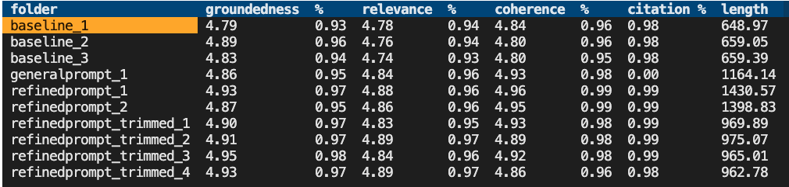

# Evaluating a RAG Chat App

This repo contains scripts and tools for evaluating a chat app that uses the RAG architecture.
There are many parameters that affect the quality and style of answers generated by the chat app,
such as the system prompt, search parameters, and GPT model parameters.

Whenever you are making changes to a RAG chat with the goal of improving the answers, you should evaluate the results.
This repository offers tools to make it easier to run evaluations, plus examples of evaluations
that we've run on our [sample chat app](https://github.com/Azure-Samples/azure-search-openai-demo/).

[ 📺 Watch a video overview of this repo](https://www.youtube.com/watch?v=mM8pZAI2C5w)

Table of contents:

* [Setting up this project](#setting-up-this-project)
* [Deploying a GPT-4 model](#deploying-a-gpt-4-model)
* [Generating ground truth data](#generating-ground-truth-data)
* [Running an evaluation](#running-an-evaluation)
* [Viewing the results](#viewing-the-results)

## Setting up this project

If you open this project in a Dev Container or GitHub Codespaces, it will automatically set up the environment for you.
If not, then follow these steps:

1. Install Python 3.10 or higher
2. Create a Python [virtual environment](https://learn.microsoft.com/azure/developer/python/get-started?tabs=cmd#configure-python-virtual-environment).
2. Inside that virtual environment, install the requirements:

    ```shell
    python -m pip install -r requirements.txt
    ```

## Deploying a GPT-4 model

It's best to use a GPT-4 model for performing the evaluation, even if your chat app uses GPT-3.5 or another model.
You can either use an Azure OpenAI instance or an openai.com instance.

### Using a new Azure OpenAI instance

To use a new Azure OpenAI instance, you'll need to create a new instance and deploy the app to it.
We've made that easy to deploy with the `azd` CLI tool.

1. Install the [Azure Developer CLI](https://aka.ms/azure-dev/install)
2. Run `azd auth login` to log in to your Azure account
3. Run `azd up` to deploy a new GPT-4 instance
4. Create a `.env` file based on the provisioned resources by running one of the following commands.

    Powershell:

    ```shell
    azd env get-values > .env
    ```

    Bash:

    ```powershell
    $output = azd env get-values; Add-Content -Path .env -Value $output;
    ```

### Using an existing Azure OpenAI instance

If you already have an Azure OpenAI instance, you can use that instead of creating a new one.

1. Create `.env` file by copying `.env.sample`
2. Fill in the values for your instance:

    ```shell
    AZURE_OPENAI_EVAL_DEPLOYMENT="<deployment-name>"
    AZURE_OPENAI_SERVICE="<service-name>"
    ```
3. The scripts default to keyless access (via `AzureDefaultCredential`), but you can optionally use a key by setting `AZURE_OPENAI_KEY` in `.env`.

### Using an openai.com instance

If you have an openai.com instance, you can use that instead of an Azure OpenAI instance.

1. Create `.env` file by copying `.env.sample`
2. Fill in the values for your OpenAI account. You might not have an organization, in which case you can leave that blank.

    ```shell
    OPENAICOM_KEY=""
    OPENAICOM_ORGANIZATION=""
    ```


## Generating ground truth data

In order to evaluate new answers, they must be compared to "ground truth" answers: the ideal answer for a particular question. See `example_input/qa.jsonl` for an example of the format.
We recommend at least 200 QA pairs if possible.

There are a few ways to get this data:

1. Manually curate a set of questions and answers that you consider to be ideal. This is the most accurate, but also the most time-consuming. Make sure your answers include citations in the expected format. This approach requires domain expertise in the data.
2. Use the generator script to generate a set of questions and answers. This is the fastest, but may also be the least accurate. See below for details on how to run the generator script.
3. Use the generator script to generate a set of questions and answers, and then manually curate them, rewriting any answers that are subpar and adding missing citations. This is a good middle ground, and is what we recommend.

<details>
 <summary>Additional tips for ground truth data generation</summary>

* Generate more QA pairs than you need, then prune them down manually based on quality and overlap. Remove low quality answers, and remove questions that are too similar to other questions.
* Be aware of the knowledge distribution in the document set, so you effectively sample questions across the knowledge space.
* Once your chat application is live, continually sample live user questions (within accordance to your privacy policy) to make sure you're representing the sorts of questions that users are asking.
</details>

### Running the generator script

This repo includes a script for generating questions and answers from documents stored in Azure AI Search.

> [!IMPORTANT]
> The generator script can only generate English Q/A pairs right now, due to [limitations in the azure-ai-generative SDK](https://github.com/Azure/azure-sdk-for-python/issues/34099).

1. Create `.env` file by copying `.env.sample`
2. Fill in the values for your Azure AI Search instance:

    ```shell
    AZURE_SEARCH_SERVICE="<service-name>"
    AZURE_SEARCH_INDEX="<index-name>"
    AZURE_SEARCH_KEY=""
    ```

    The key may not be necessary if it's configured for keyless access from your account.
    If providing a key, it's best to provide a query key since the script only requires that level of access.

3. Run the generator script:

    ```shell
    python -m scripts generate --output=example_input/qa.jsonl --numquestions=200 --persource=5
    ```

    That script will generate 200 questions and answers, and store them in `example_input/qa.jsonl`. We've already provided an example based off the sample documents for this app.

    To further customize the generator beyond the `numquestions` and `persource` parameters, modify `scripts/generate.py`.


## Running an evaluation

We provide a script that loads in the current `azd` environment's variables, installs the requirements for the evaluation, and runs the evaluation against the local app. Run it like this:

```shell
python -m scripts evaluate --config=example_config.json
```

The config.json should contain these fields as a minimum:

```json
{
    "testdata_path": "example_input/qa.jsonl",
    "target_url": "http://localhost:50505/chat",
    "requested_metrics": ["groundedness", "relevance", "coherence", "latency", "answer_length"],
    "results_dir": "example_results/experiment<TIMESTAMP>"
}
```

### Running against a local container

If you're running this evaluator in a container and your app is running in a container on the same system, use a URL like this for the `target_url`:

"target_url": "http://host.docker.internal:50505/chat"

### Running against a deployed app

To run against a deployed endpoint, change the `target_url` to the chat endpoint of the deployed app:

"target_url": "https://app-backend-j25rgqsibtmlo.azurewebsites.net/chat"

### Running on a subset of questions

It's common to run the evaluation on a subset of the questions, to get a quick sense of how the changes are affecting the answers. To do this, use the `--numquestions` parameter:

```shell
python -m scripts evaluate --config=example_config.json --numquestions=2
```

### Specifying the evaluate metrics

The `evaluate` command will use the metrics specified in the `requested_metrics` field of the config JSON.
Some of those metrics are built-in to the evaluation SDK, and the rest are custom metrics that we've added.

#### Built-in metrics

These metrics are calculated by sending a call to the GPT model, asking it to provide a 1-5 rating, and storing that rating.

> [!IMPORTANT]
> The built-in metrics are only intended for use on evaluating English language answers, due to [limitations in the azure-ai-generative SDK](https://github.com/Azure/azure-sdk-for-python/issues/34099).

* [`gpt_coherence`](https://learn.microsoft.com/azure/ai-studio/concepts/evaluation-metrics-built-in#ai-assisted-coherence) measures how well the language model can produce output that flows smoothly, reads naturally, and resembles human-like language.
* [`gpt_relevance`](https://learn.microsoft.com/azure/ai-studio/concepts/evaluation-metrics-built-in#ai-assisted-relevance) assesses the ability of answers to capture the key points of the context.
* [`gpt_groundedness`](https://learn.microsoft.com/azure/ai-studio/concepts/evaluation-metrics-built-in#ai-assisted-groundedness) assesses the correspondence between claims in an AI-generated answer and the source context, making sure that these claims are substantiated by the context.

#### Custom metrics

##### Prompt metrics

The following metrics are implemented very similar to the built-in metrics, but use a locally stored prompt. They're a great fit if you find that the built-in metrics are not working well for you or if you need to translate the prompt to another language.

* `coherence`: Measures how well the language model can produce output that flows smoothly, reads naturally, and resembles human-like language. Based on `scripts/evaluate_metrics/prompts/coherence.jinja2`.
* `relevance`: Assesses the ability of answers to capture the key points of the context. Based on `scripts/evaluate_metrics/prompts/relevance.jinja2`.
* `groundedness`: Assesses the correspondence between claims in an AI-generated answer and the source context, making sure that these claims are substantiated by the context. Based on `scripts/evaluate_metrics/prompts/groundedness.jinja2`.

##### Code metrics

These metrics are calculated with some local code based on the results of the chat app, and do not require a call to the GPT model.

* `latency`: The time it takes for the chat app to generate an answer, in seconds.
* `length`: The length of the generated answer, in characters.
* `answer_has_citation`: Whether the answer contains a correctly formatted citation to a source document, assuming citations are in square brackets.

### Sending additional parameters to the app

This repo assumes that your chat app is following the [Chat App Protocol](https://github.com/Azure-Samples/ai-chat-app-protocol), which means that all POST requests look like this:

```json
{"messages": [{"content": "<Actual user question goes here>", "role": "user"}],
 "stream": False,
 "context": {...},
}
```

Any additional app parameters would be specified in the `context` of that JSON, such as temperature, search settings, prompt overrides, etc. To specify those parameters, add a `target_parameters` key to your config JSON. For example:

```json
    "target_parameters": {
        "overrides": {
            "semantic_ranker": false,
            "prompt_template": "<READFILE>example_input/prompt_refined.txt"
        }
    }
```

The `overrides` key is the same as the `overrides` key in the `context` of the POST request.
As a convenience, you can use the `<READFILE>` prefix to read in a file and use its contents as the value for the parameter.
That way, you can store potential (long) prompts separately from the config JSON file.

## Viewing the results

The results of each evaluation are stored in a results folder (defaulting to `example_results`).
Inside each run's folder, you'll find:

- `eval_results.jsonl`: Each question and answer, along with the GPT metrics for each QA pair.
- `parameters.json`: The parameters used for the run, like the overrides.
- `summary.json`: The overall results, like the average GPT metrics.
- `config.json`: The original config used for the run. This is useful for reproducing the run.

To make it easier to view and compare results across runs, we've built a few tools,
located inside the `review-tools` folder.


### Using the summary tool

To view a summary across all the runs, use the `summary` command with the path to the results folder:

```bash
python -m review_tools summary example_results
```

This will display an interactive table with the results for each run, like this:



To see the parameters used for a particular run, select the folder name.
A modal will appear with the parameters, including any prompt override.

### Using the compare tool

To compare the answers generated for each question across 2 runs, use the `compare` command with 2 paths:

```bash
python -m review_tools diff example_results/baseline_1 example_results/baseline_2
```

This will display each question, one at a time, with the two generated answers in scrollable panes,
and the GPT metrics below each answer.

]

Use the buttons at the bottom to navigate to the next question or quit the tool.
